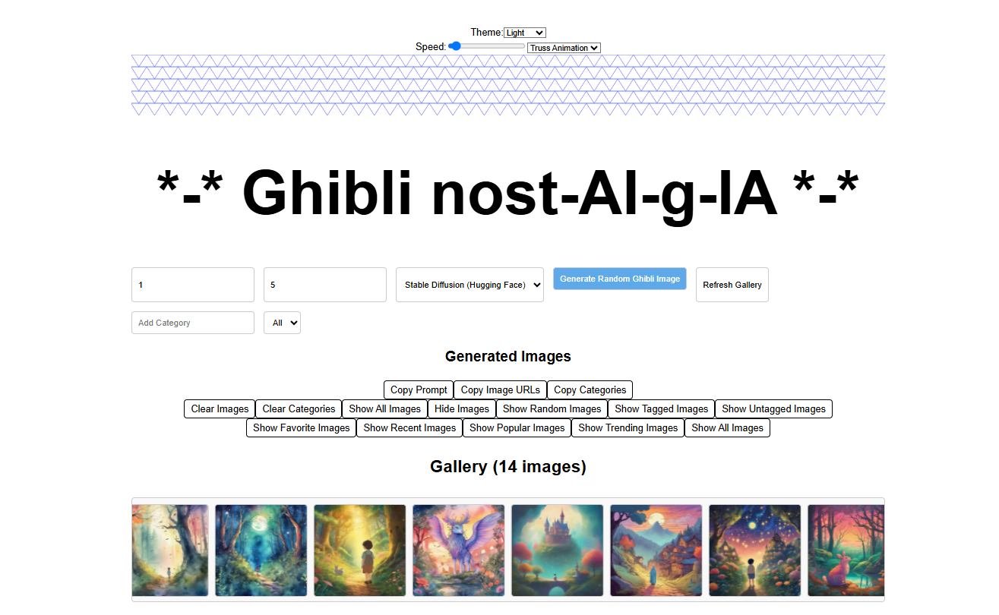

# Ghibli Image Generator


## Overview
The Ghibli Image Generator is a web-based application that allows users to generate Studio Ghibli-inspired images using AI. Users can:
- Generate random Ghibli-style images based on prompts.
- View generated images in a horizontally scrolling gallery.
- Click on images to view them in a popup.
- Switch between light and dark themes.
- Choose between different animations (e.g., Truss Animation, Bouncing Balls).


## Features
- **Random Image Generation**: Generate images using AI with random prompts inspired by Studio Ghibli.
- **Gallery**: View generated images in a scrolling gallery with thumbnails.
- **Popup View**: Click on an image to enlarge it in a popup.
- **Theme Selector**: Switch between light and dark themes.
- **Animations**: Choose between Truss Animation and Bouncing Balls for visual effects.

## Installation
1. Clone the repository:
   ```bash
   git clone <repository-url>
   ```
2. Navigate to the project directory:
   ```bash
   cd ghibli-image-genator
   ```
3. Install dependencies:
   ```bash
   npm install
   ```

## Usage
1. Start the development server:
   ```bash
   npm run dev
   ```
2. Open your browser and navigate to:
   ```
   http://localhost:5173
   ```

## Project Structure
```
src/
  App.css          # Main CSS file for styling
  App.tsx          # Main React component
  config.ts        # Configuration file for API keys and endpoints
  index.css        # Global CSS styles
  main.tsx         # Entry point for the React app
  server.js        # Backend server for saving images
  components/      # Reusable React components
    BouncingBalls.tsx
    GeometricShapes.tsx
    TrussAnimation.tsx
  imagesGenerated/ # Folder for storing generated images
```

## Dependencies
- React
- TypeScript
- Vite
- Axios
- UUID

## API Integration
The application integrates with multiple AI image generation APIs. Configure your API keys in `src/config.ts`.

## Contributing
1. Fork the repository.
2. Create a new branch:
   ```bash
   git checkout -b feature-name
   ```
3. Commit your changes:
   ```bash
   git commit -m "Add feature-name"
   ```
4. Push to the branch:
   ```bash
   git push origin feature-name
   ```
5. Open a pull request.

## License
This project is licensed under the MIT License.

## Acknowledgments
- Inspired by Studio Ghibli's art style.
- Built with React and Vite.
